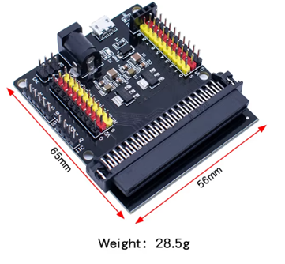

# **KIT DE 71 COMPONENTES ELECTRONICOS PARA MICRO:BIT Y ARDUINO**
*Componente dentro del kit de sensores, actuadores y componentes basicos para aula-laboratorio de informática y robótica*
# **Micro bit Sensor Shield V2 Placa de Ampliación.**
## **1. Descripción**
Panel de conectores para tarjetas Microbit, compatible v1 y v2.

Facilita la conexión con cualquier tipo de sensores.  Evita el conexionado con pinzas de cocodrilo. Expande las posibilidades de conexión a cualquier tipo de comunicación mediante 3 conexiones por canal – facilita sensores Grove, octupus, etc…)

Permite utilizar sensores con alimentación a 3,3 V o a 5 V, simplemente con un jumper (conector incluido)

Interfaces de conexión I2C y SPI incluidas y accesibles facilmente.

Alimentación por micro-usb o toma alimentador 7 – 9V.
## **2. Web de interes**

## **3. Foto**

