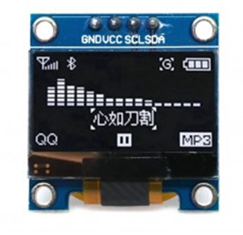

# **KIT DE 71 COMPONENTES ELECTRONICOS PARA MICRO:BIT Y ARDUINO**
*Componente dentro del kit de sensores, actuadores y componentes basicos para aula-laboratorio de informática y robótica*
# **Pantalla Oled 0.96**
## **1. Descripción**
Voltaje de operación: 3V – 5.5V DC

Driver: SSD1306

Interfaz: I2C

Resolución: 128*64 píxeles

Monocromo: píxeles blancos (fondo negro)

Ángulo de visión: 160º

Área visible (display): 23*11.5 mm

Consumo de energía ultra bajo: 0.08W (cuando están encendidos todos los píxeles)

Temperatura de trabajo: -30ºC ~ 70ºC

Dimensiones: 27*27*4.1mm

Peso: 5 gramos
## **2. Web de interes**
https://electropeak.com/learn/the-beginners-guide-to-display-text-image-animation-on-oled-display-by-arduino/
## **3. Foto**

