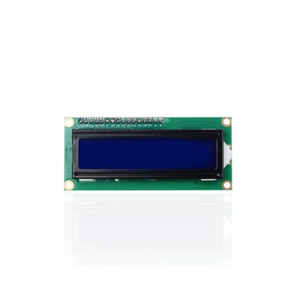

# **KIT DE 71 COMPONENTES ELECTRONICOS PARA MICRO:BIT Y ARDUINO**
*Componente dentro del kit de sensores, actuadores y componentes basicos para aula-laboratorio de informática y robótica*
# **Pantalla LCD 1602 con I2C**
## **1. Descripción**
Placa IIC / I2C

Alimentación: 5v

Pines: 16 (soldado i2c a los pines)

Compatible con Arduino

Dimensiones: 8x3,5x1 cm (aprox)

Peso: 35,6g aprox.
## **2. Web de interes**
https://eloctavobit.com/modulos-sensores/pantalla-lcd-1602-luz-verde-compatible
## **3. Foto**

