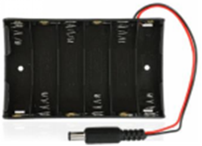

# **KIT DE 71 COMPONENTES ELECTRONICOS PARA MICRO:BIT Y ARDUINO**
*Componente dentro del kit de sensores, actuadores y componentes basicos para aula-laboratorio de informática y robótica*
# **Portapilas 6xAA**
## **1. Descripción**
Soporte de batería para 6 pilas AA con enchufe de CC

Conector de alimentación JACK

Tensión de suministro nominal = 9 V.

Material: plástico ABS

## **2. Web de interes**

## **3. Foto**

