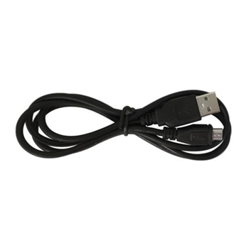

# **KIT DE 71 COMPONENTES ELECTRONICOS PARA MICRO:BIT Y ARDUINO**
*Componente dentro del kit de sensores, actuadores y componentes basicos para aula-laboratorio de informática y robótica*
# **Cable USB-MicroUSB**
## **1. Descripción**
Cable USB-MicroUSB
## **2. Web de interes**

## **3. Foto**

