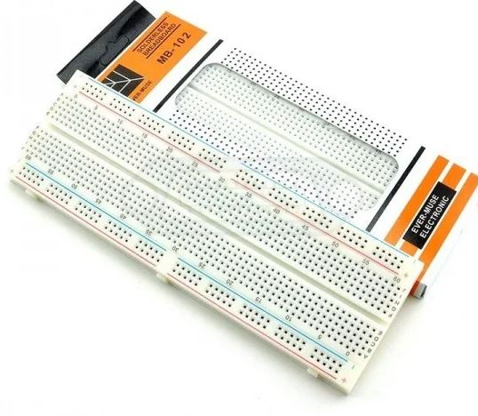

# **KIT DE 71 COMPONENTES ELECTRONICOS PARA MICRO:BIT Y ARDUINO**
*Componente dentro del kit de sensores, actuadores y componentes basicos para aula-laboratorio de informática y robótica*
# **Placa de prototipos 830 puntos**
## **1. Descripción**
Las protoboards tienen un código de localización de los orificios. 

Consiste en numerar vertical y horizontalmente la matriz de orificios que conforman una protoboard. 

Para las filas, se emplean las letras del abecedario, y para las columnas, se emplean números enteros.
## **2. Web de interes**
https://eloctavobit.com/modulos-sensores/protoboard-placa-de-pruebas
## **3. Foto**

