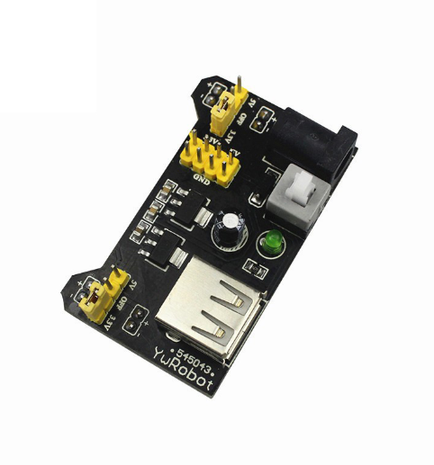

# **KIT DE 71 COMPONENTES ELECTRONICOS PARA MICRO:BIT Y ARDUINO**
*Componente dentro del kit de sensores, actuadores y componentes basicos para aula-laboratorio de informática y robótica*
# **Fuente de alimentación**
## **1. Descripción**
Voltaje de entrada (Jack): 6.5 a 12V

Voltaje de salida: 3.3V y 5V

Corriente máxima: 700mA

Dimensiones: 53 x 35 mm
## **2. Web de interes**
https://www.youtube.com/watch?app=desktop&v=tznNsm4ep8k
## **3. Foto**

