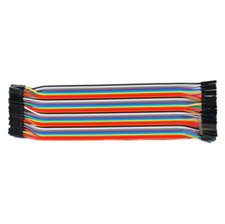

# **KIT DE 71 COMPONENTES ELECTRONICOS PARA MICRO:BIT Y ARDUINO**
*Componente dentro del kit de sensores, actuadores y componentes basicos para aula-laboratorio de informática y robótica*
# **40 cables Hembra-Hembra Dupont de 20 cm**
## **1. Descripción**
Juego de 40 líneas tipo dupont para usar con placas de prototipo, conexión de módulos, proyectos, etc ...

Conectores macho/macho y múltiples colores. 

Longitud de 20cm.
## **2. Web de interes**

## **3. Foto**

