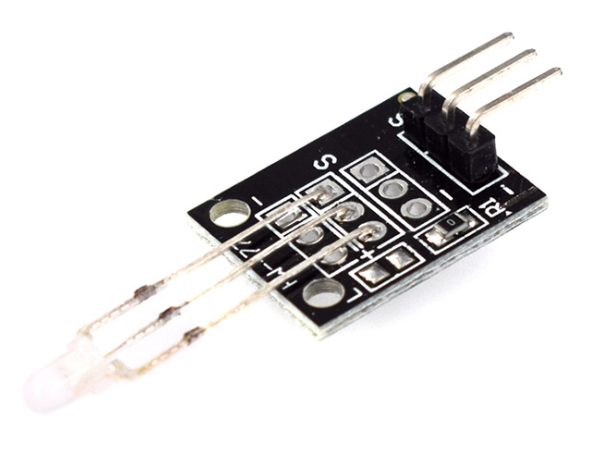

# **KIT DE 71 COMPONENTES ELECTRONICOS PARA MICRO:BIT Y ARDUINO**
*Componente dentro del kit de sensores, actuadores y componentes basicos para aula-laboratorio de informática y robótica*
# **Led Bicolor KY-029**
## **1. Descripción**
-Consta de un LED bicolor, una resistencia smd eléctrica y un header

macho de ángulo de 3 pines

-Voltaje de alimentación : verde (2.3 V - 6 V); rojo (1.9 V - 2.2 V)

-Corriente: 20mA

-Salida: digital (0 lógico corresponde a 0V y 1 lógico a 5V)

-Tipo de diodo: difusión

-Color: verde + rojo

-Ángulo de visión: longitud de onda, 571-625nm

-Diámetro: 3mm

-Intensidad luminosa (MCD): 20-40; 60-80

-Tipo de stent: pierna larga

-Dimensiones: 30X15X13mm

-Peso: 1,5gr
## **2. Web de interes**
https://arduinomodules.info/ky-029-dual-color-led-module/
## **3. Foto**

