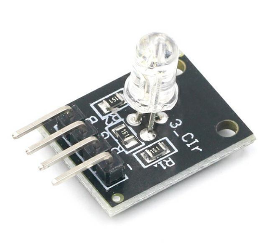

# **KIT DE 71 COMPONENTES ELECTRONICOS PARA MICRO:BIT Y ARDUINO**
*Componente dentro del kit de sensores, actuadores y componentes basicos para aula-laboratorio de informática y robótica*
# **LED RGB KY-016**
## **1. Descripción**
-Voltaje: 5V

-Ajuste a través de los pines R,G,B, mediante PWM

-Incluye resistencia tricromática que limita la corriente del LED y evita que se queme

-LED con cátodo común 

-Medidas 19x15x15mm

-Peso 2 gr.
## **2. Web de interes**
https://arduinomodules.info/ky-016-rgb-full-color-led-module/
## **3. Foto**

