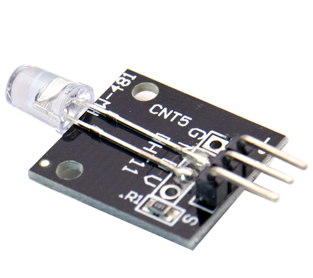

# **KIT DE 71 COMPONENTES ELECTRONICOS PARA MICRO:BIT Y ARDUINO**
*Componente dentro del kit de sensores, actuadores y componentes basicos para aula-laboratorio de informática y robótica*
# **Led Intermitente KY-034 Flash de 7 colores **
## **1. Descripción**
-Voltaje de funcionamiento: 3 a 5V DC

-Tipo de productor: LED

-Forma: redondo tipo de LED DIP 5mm

-Grupo de colores: verde, azul y rojo (alto brillo)

-Tipo de lente: niebla blanca

-Dimensiones: 19X17X20 mm

-Peso: 2gr.
## **2. Web de interes**
https://arduinomodules.info/ky-034-automatic-flashing-color-led/
## **3. Foto**

