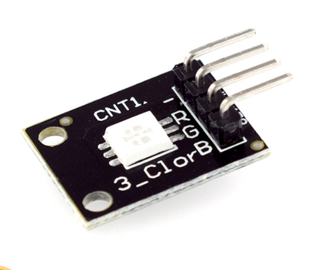

# **KIT DE 71 COMPONENTES ELECTRONICOS PARA MICRO:BIT Y ARDUINO**
*Componente dentro del kit de sensores, actuadores y componentes basicos para aula-laboratorio de informática y robótica*
# **LED RGB SMD KY-009**
## **1. Descripción**
Emite una gama de colores mezclando rojo, verde y azul. La cantidad de cada color primario se ajusta usando PWM. Este módulo consta de un LED 5050 y se usa con resistencias limitadoras para evitar el
agotamiento.

-Tensión de funcionamiento: 5V max.

-Tensión de funcionamiento del LED Rojo: 1.8V~2.4V

-Tensión de funcionamiento del LED verde: 2.8V~3.6V

-Tensión de funcionamiento del LED azul: 2.8V ~3.6V

-Corriente directa: 20mA ~ 30mA

-Temperatura de funcionamiento: -25ºC a 85ºC [-13ºF ~ 185ºF]

-Dimensiones: 18.5mmX15mm
## **2. Web de interes**
https://arduinomodules.info/ky-009-rgb-full-color-led-smd-module/
## **3. Foto**

