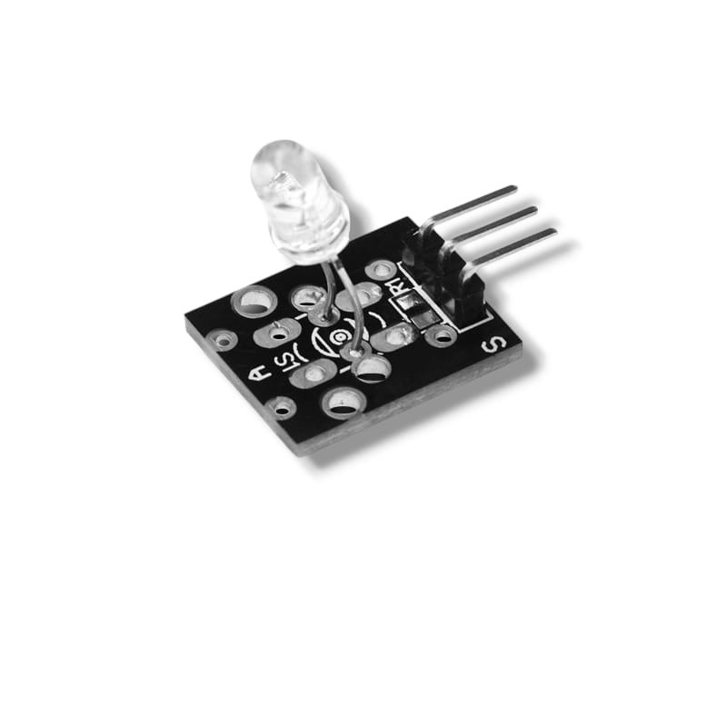

# **KIT DE 71 COMPONENTES ELECTRONICOS PARA MICRO:BIT Y ARDUINO**
*Componente dentro del kit de sensores, actuadores y componentes basicos para aula-laboratorio de informática y robótica*
# **Diodo Emisor IR KY-005**
## **1. Descripción**
Voltaje de funcionamiento: 5V

Corriente alimentación: 30 a 60 mA DC

Consumo de energía: 90 mW

Temperatura de funcionamiento: -25°C a 80°C

Frecuencia: 38 kHz

Peso: 2 g

Longitud de onda: 940nm
Corriente directa 30 – 60 mA
Pines : Señal, VCC y GND.
## **2. Web de interes**
https://arduinomodules.info/ky-005-infrared-transmitter-sensor-module/
## **3. Foto**

