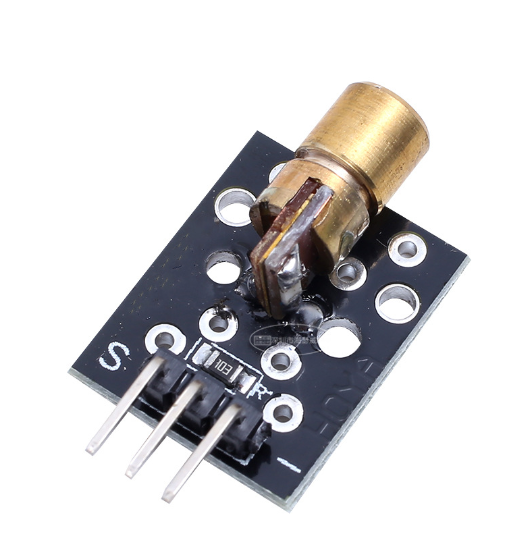

# **KIT DE 71 COMPONENTES ELECTRONICOS PARA MICRO:BIT Y ARDUINO**
*Componente dentro del kit de sensores, actuadores y componentes basicos para aula-laboratorio de informática y robótica*
# **Diodo emisor laser**
## **1. Descripción**
-Voltaje de funcionamiento: 5V

-Largo de onda: 650nm

-Profundidad: 8mm

-Potencia: 5mW

-Corriente: 40mA

-Dimensiones: 18.5 X 15mm

Extremar precauciones en su uso debido a la luz del láser.
## **2. Web de interes**
https://arduinomodules.info/ky-008-laser-transmitter-module/
## **3. Foto**

