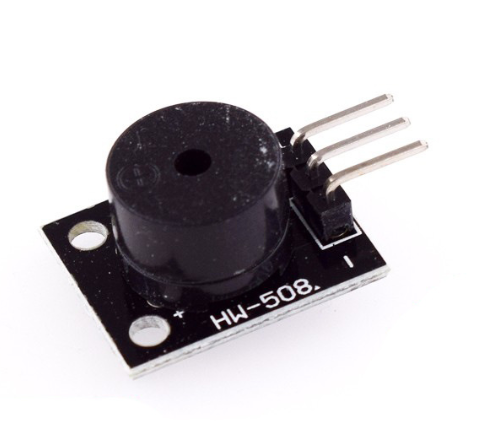

# **KIT DE 71 COMPONENTES ELECTRONICOS PARA MICRO:BIT Y ARDUINO**
*Componente dentro del kit de sensores, actuadores y componentes basicos para aula-laboratorio de informática y robótica*
# **Zumbador Pasivo KY-006**
## **1. Descripción**
-Produce una gama de tonos dependiendo de la frecuencia de entrada

-Voltaje de funcionamiento: 1.5V-5V DC

-Rango de generación de tonos: 1.5-2.5KHz

-3 Pines: (-) GND;VCC; (s) señal

-Corriente de trabajo: <25mA

-Dimensiones: 18X15mm
## **2. Web de interes**
https://arduinomodules.info/ky-006-passive-buzzer-module/
## **3. Foto**

