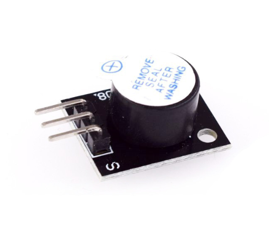

# **KIT DE 71 COMPONENTES ELECTRONICOS PARA MICRO:BIT Y ARDUINO**
*Componente dentro del kit de sensores, actuadores y componentes basicos para aula-laboratorio de informática y robótica*
# **Zumbador Activo KY-012**
## **1. Descripción**
Este sensor consta de un electroimán (o disco piezoeléctrico) y una lámina metálica de acero

-Voltaje de funcionamiento: 3,5V-5.5V

-Corriente máxima: 30mA/5V

-Frecuencia de resonancia: 2500Hz± 300Hz

-Salida de sonido mínima. 85db a 10cm

-Temperatura de trabajo: -20ºC a 70ºC [-4ºF a 158ºF]

-Temperatura de almancenamiento: -30ºC a 105ºC [-22ºF s 221ºF]

-Dimensiones: 18,5X16X11mm
## **2. Web de interes**
https://arduinomodules.info/ky-012-active-buzzer-module/
## **3. Foto**

