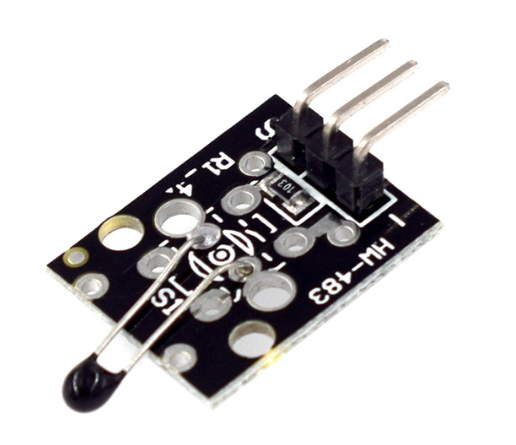

# **KIT DE 71 COMPONENTES ELECTRONICOS PARA MICRO:BIT Y ARDUINO**
*Componente dentro del kit de sensores, actuadores y componentes basicos para aula-laboratorio de informática y robótica*
# **Sensor de temperatura con NTC analógico KY-013**
## **1. Descripción**
-Consta de un termistor NTC y una resitencia de 10KO

-Voltaje de funcionamiento: 5V

-Bajo consumo de energía

-Rango de medición de temperatura: -55ºC a +125ºC

-Precisión de la medición: ±0.5ºC

-Dimensiones: 22X15X9 mm

-Peso: 1gr
## **2. Web de interes**
https://arduinomodules.info/ky-013-analog-temperature-sensor-module/
## **3. Foto**

