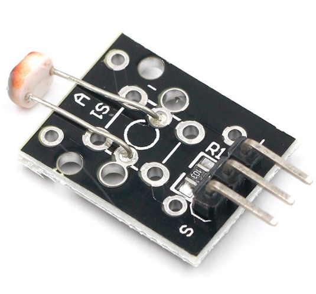

# **KIT DE 71 COMPONENTES ELECTRONICOS PARA MICRO:BIT Y ARDUINO**
*Componente dentro del kit de sensores, actuadores y componentes basicos para aula-laboratorio de informática y robótica*
# **Sensor Fotoresistor KY-018**
## **1. Descripción**
Sensor receptor infrarrojo IR, construido básicamente de un sensor infrarrojo 1838, un led indicador, una resistencia smd 102 y un header
macho de ángulo 3 pines.

-Voltaje de funcionamiento: 2.7 V - 5.5V

-Corriente de funcionamiento: 0.4mA a 1.5mA

-Distancia de recepción: 18m

-Ángulo de recepción: ±45º

-Frecuencia portadora: 38KHz

-Voltaje de bajo nivel: 0.4V

-Voltaje de alto nivel: 4.5V

-Filtro de luz ambiente: hasta 500 LUX

-Dimensiones: 15X18.5X10mm

-Peso: 1gr
## **2. Web de interes**
https://arduinomodules.info/ky-018-photoresistor-module/
## **3. Foto**

