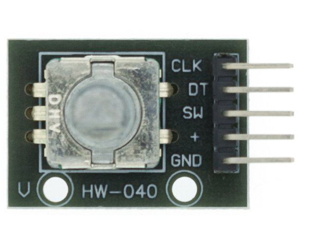

# **KIT DE 71 COMPONENTES ELECTRONICOS PARA MICRO:BIT Y ARDUINO**
*Componente dentro del kit de sensores, actuadores y componentes basicos para aula-laboratorio de informática y robótica*
# **Sensor de rotación analógico KY-040**
## **1. Descripción**
El encoder es un dispositivo electromagnético que indica mediante posiciones modificadas su posicion

-Voltaje de funcionamiento: 5V

-Corriente: 10mA

-Posiciones: 12 (cada 30º)

-Pulsos por revolución: 20

-Dimensiones: 20X30X30 mm

-Peso: 10gr
## **2. Web de interes**
https://eloctavobit.com/modulos-sensores/codificador-rotatorio-ky-040-rotary-encoder
## **3. Foto**

