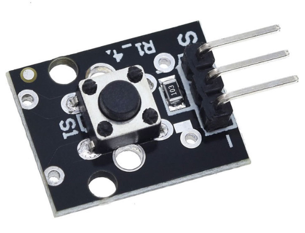

# **KIT DE 71 COMPONENTES ELECTRONICOS PARA MICRO:BIT Y ARDUINO**
*Componente dentro del kit de sensores, actuadores y componentes basicos para aula-laboratorio de informática y robótica*
# **Módulo Pulsador Digital KY-004**
## **1. Descripción**
-Consta de un interruptor de botón táctil FZ713 y una resistencia

-Clasificación: 50mA 12VC

-Fuerza de operación: 180/230 (±20gf)

-Valor de funcionamiento: 3.3V-5V

-Temperatura ambiental: -25ºC a 125ºC [-13ºF a 221ºF]

-Vida de contacto: 100.000 ciclos

-Interruptor digital salida (0/1)

-Dimensiones: 18,5X15mm
## **2. Web de interes**
https://arduinomodules.info/ky-004-key-switch-module/#google_vignette
## **3. Foto**

