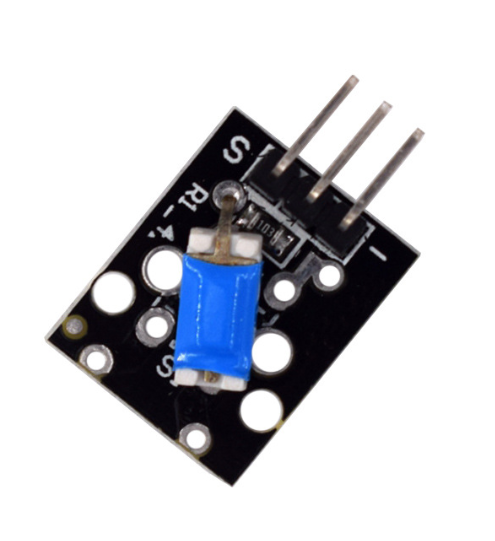

# **KIT DE 71 COMPONENTES ELECTRONICOS PARA MICRO:BIT Y ARDUINO**
*Componente dentro del kit de sensores, actuadores y componentes basicos para aula-laboratorio de informática y robótica*
# **Sensor de inclinación KY-020**
## **1. Descripción**
Consiste en una resistencia de 10KO y un interruptor metálico de bola con conducción bidireccional que abrirá/cerrará el circuito dependiendo de su grado de inclinación.

-No mide el grado de inclinación

-Tipo: sensor de inclinación

-Tensión de funcionamiento: 3.3V-5V

-Tipo de salida: digital

-Vida mecánica: 100.000 ciclos

-Dimensiones: 23X16X5mm
## **2. Web de interes**
https://arduinomodules.info/ky-020-tilt-switch-module/
## **3. Foto**

