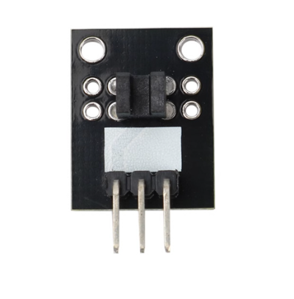

# **KIT DE 71 COMPONENTES ELECTRONICOS PARA MICRO:BIT Y ARDUINO**
*Componente dentro del kit de sensores, actuadores y componentes basicos para aula-laboratorio de informática y robótica*
# **Sensor Foto-interruptor KY-010**
## **1. Descripción**
-Voltaje de funcionamiento: 3.3V-5V

-Interruptor de salida: (0/1)

-3 Pines: GND; VCC; Señal

-Dimensiones: 5X15mm

-Peso: 2gr
## **2. Web de interes**
https://arduinomodules.info/ky-010-photo-interrupter-module/
## **3. Foto**

