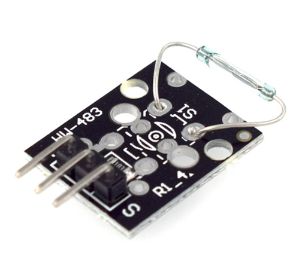

# **KIT DE 71 COMPONENTES ELECTRONICOS PARA MICRO:BIT Y ARDUINO**
*Componente dentro del kit de sensores, actuadores y componentes basicos para aula-laboratorio de informática y robótica*
# **Sensor Hall KY-003**
## **1. Descripción**
Basa su principio de funcionamiento en el Efecto Hall. Puede ser un excelente sensor de posición sin contacto. Chip A3144

-Voltaje de funcionamiento: 5V-24V

-Consumo de energía: 3mA (reposo), 8mA (activo)

-Salida: digital

-Temperatura de funcionamiento: -25º a 85ºC
## **2. Web de interes**
https://arduinomodules.info/ky-003-hall-magnetic-sensor-module/
## **3. Foto**

