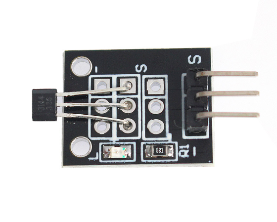

# **KIT DE 71 COMPONENTES ELECTRONICOS PARA MICRO:BIT Y ARDUINO**
*Componente dentro del kit de sensores, actuadores y componentes basicos para aula-laboratorio de informática y robótica*
# **Sensor Reed, interruptor KY-021**
## **1. Descripción**
Sensor interruptor magnético que permite detectar campos magnéticos de forma ràpida, fácil y eficiente.

-Voltaje de funcionamiento: 3.3V-5V

-Tipo de salida: digital

-Bajo consumo de energía

-Resistencia: 10KO

-Dimensiones: 21X15X9mm

-Peso:2gr
## **2. Web de interes**
https://arduinomodules.info/ky-021-mini-magnetic-reed-switch-module/
## **3. Foto**

