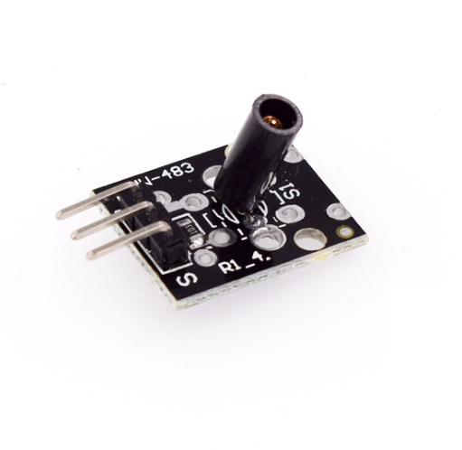

# **KIT DE 71 COMPONENTES ELECTRONICOS PARA MICRO:BIT Y ARDUINO**
*Componente dentro del kit de sensores, actuadores y componentes basicos para aula-laboratorio de informática y robótica*
# **Sensor Vibración KY-002**
## **1. Descripción**
-Permite la detección de vibraciones y golpes

-Voltaje de funcionamiento: 3.3V-5V

-Tensión de trabajo: 3.3V-5V

-Ciclo de vida: hasta 500.000 detecciones

-Capacidad anti-interferencia

-Señal digital de salida

-Pin estándar de 2.54mm para hacer conexiones de entrada y salida

-Dimensiones: 18.5X15mm

-Peso:4gr
## **2. Web de interes**
https://arduinomodules.info/ky-002-vibration-switch-module/
## **3. Foto**

