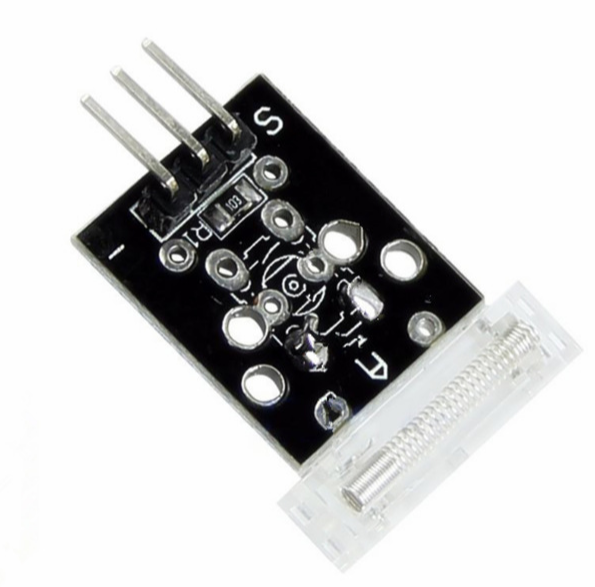

# **KIT DE 71 COMPONENTES ELECTRONICOS PARA MICRO:BIT Y ARDUINO**
*Componente dentro del kit de sensores, actuadores y componentes basicos para aula-laboratorio de informática y robótica*
# **Sensor de Impacto KY-031**
## **1. Descripción**
Sensor con capacidad de percibir los impactos

-Voltaje de funcionamiento: 5V CD

-Tipo de señal emitida: digital

-Voltaje de salida: "0" y "1" lógico (0 y 5V respectivamente)

-Corriente: 10mA

-Dimensiones: 29X17X4mm

-Peso: 4gr
## **2. Web de interes**
https://arduinomodules.info/ky-031-knock-sensor-module/
## **3. Foto**

