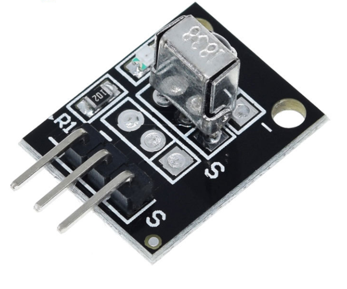

# **KIT DE 71 COMPONENTES ELECTRONICOS PARA MICRO:BIT Y ARDUINO**
*Componente dentro del kit de sensores, actuadores y componentes basicos para aula-laboratorio de informática y robótica*
# **Receptor de Infrarojos KY-022**
## **1. Descripción**
Sensor infrarrojo IR, construido básicamente de un receptor infrarrojo 1838, un LED indicador, una resistencia smd 102 y header macho de ángulo de 3 pimes.

-Voltaje de funcionamiento: 2.7V-5.5V

-Corriente de funcionamiento: 0.4mA-1.5mA

-Distancia de recepción:18m

-Ángulo de recepción: ±45º

-Frecuencia portadora: 38KHz

-Voltaje de bajo nivel: 0.4V

-Voltaje de alto nivel: 4.5V

-Filtro de luz ambiente hasta: 500 LUX

-Dimensiones: 15X18.5X10mm

-Peso: 3gr
## **2. Web de interes**
https://arduinomodules.info/ky-022-infrared-receiver-module/
## **3. Foto**

