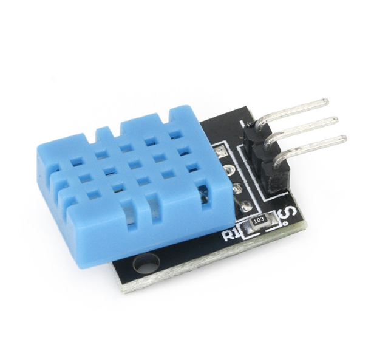

# **KIT DE 71 COMPONENTES ELECTRONICOS PARA MICRO:BIT Y ARDUINO**
*Componente dentro del kit de sensores, actuadores y componentes basicos para aula-laboratorio de informática y robótica*
# **Sensor de temperatura DHT11**
## **1. Descripción**
Sensor de temperatura y humedad relativa de media precisión. Usa un termistor NTC y un sensor de humedad para detectar las condiciones del
entorno. 

-Voltaje de funcionamiento 3.5V-5.5V

-Bajo consumo de energía

-Rango de medición de humedad 20% a 90% RH (error de medición de humedad ±5%)

-Resolución de medición de humedad: 1% RH

-Rango de medición de tempertura: 0ºC a 50ºC [32ºF a 122ºF] (Error de medición de temperatura: ± 2º)

-Resolución de medición de temperatura: 1ºC

-Rango de transmisión de señal:20m

-Dimensiones: 19X17X19mm

-Peso:2gr
## **2. Web de interes**
https://arduinomodules.info/ky-015-temperature-humidity-sensor-module/
## **3. Foto**

