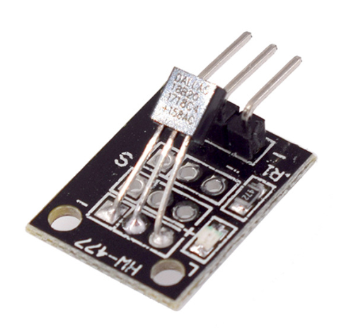

# **KIT DE 71 COMPONENTES ELECTRONICOS PARA MICRO:BIT Y ARDUINO**
*Componente dentro del kit de sensores, actuadores y componentes basicos para aula-laboratorio de informática y robótica*
# **Sensor Temperatura 18B20 KY-001**
## **1. Descripción**
-Consta de un sensor de temperatura digital de bus único DS18B20, un LED y una resistencia

-Tensión de funcionamiento: 3V-5.5V

-Rango de medición de temperatura: -55ºC a 155ºC [-57ºF a 257ºF]

-Rango de precisión de medición: ±0.5ºC

-Dimensiones: 18.5X15mm
## **2. Web de interes**
https://arduinomodules.info/ky-001-temperature-sensor-module/
## **3. Foto**

