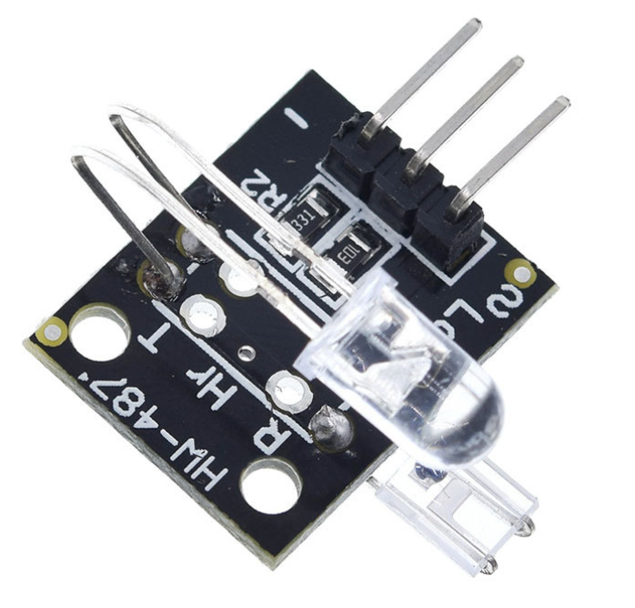

# **KIT DE 71 COMPONENTES ELECTRONICOS PARA MICRO:BIT Y ARDUINO**
*Componente dentro del kit de sensores, actuadores y componentes basicos para aula-laboratorio de informática y robótica*
# **Sensor ritmo cardiaco KY-039**
## **1. Descripción**
Este módulo utiliza un LED infrarrojo ultra brillante y un fototransistor para detectar el pulso sanguíneo en un dedo de la mano.

-Voltaje de funcionamiento: 5V

- Salida: análogoa

-Material: PCB

-Dimensiones: 25X22X17mm

-Peso: 2g 
## **2. Web de interes**
https://electropeak.com/learn/interfacing-ky-039-finger-heartbeat-measuring-sensor-module-with-arduino/
## **3. Foto**

