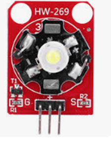

# **KIT DE 71 COMPONENTES ELECTRONICOS PARA MICRO:BIT Y ARDUINO**
*Componente dentro del kit de sensores, actuadores y componentes basicos para aula-laboratorio de informática y robótica*
# **Módulo LED 3W Blanco**
## **1. Descripción**
Temperatura de color: 6000 ~ 7000K

Flujo luminoso: 180 ~ 210lm

Corriente: 700 ~ 750mA

Potencia: 3W

Ángulo de luz: 140 grados

Temperatura de trabajo: -50 ~ 80°C

Temperatura de almacenamiento: -50 ~ 100°C

Módulo LED de alta potencia, controlado por microcontrolador de puerto 10

Ideal para aplicaciones de plataforma de búsqueda y rescate

IO Tipo: Digital

Voltaje de suministro: 3.3V to 5V

Tamaño: 40x28mm

## **2. Web de interes**
https://acortes.co/proyecto-12-modulo-hw-269-led-de-alta-potencia/
## **3. Foto**

