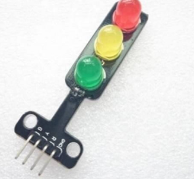

# **KIT DE 71 COMPONENTES ELECTRONICOS PARA MICRO:BIT Y ARDUINO**
*Componente dentro del kit de sensores, actuadores y componentes basicos para aula-laboratorio de informática y robótica*
# **Módulo tres led "Semáforo"**
## **1. Descripción**
El modulo tiene marcado los pines que corresponden a cada color y de acuerdo al microcontrolador o placa de desarrollo que vas utilizar, conectar en los pines digitales y después selecciona un entorno de programación te recomendamos el IDE de Arduino ya que este te permitirá programarlo de manera rápida y sencilla.

Colores de los LED: Rojo, Amarillo y Verde

Nivel activo: Alto Nivel

Voltaje de funcionamiento: 3.3V o 5V

Corriente Led Rojo: 13mA en 5V

Corriente Led Amarillo: 13mA en 5V

Corriente Led Verde: 25mA en 5V

Aptos para conectar al pin PWM para controlar el brillo.

Medidas 56mm x 21mm x 11mm.

2 Orificios de fijación de 3mm

Brillo: Brillo Normal

Interfaz: Cátodo Común, Rojo, Amarillo, Verde

GND: Común

R: led rojo

Y: led amarillo

G: led verde

## **2. Web de interes**

## **3. Foto**

