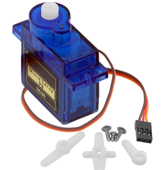

# **KIT DE 71 COMPONENTES ELECTRONICOS PARA MICRO:BIT Y ARDUINO**
*Componente dentro del kit de sensores, actuadores y componentes basicos para aula-laboratorio de informática y robótica*
# **Micro Servo SG90**
## **1. Descripción**
El servo SG90 es probablemente uno de los servomotores más versátiles y usado en todo tipo de proyectos de robótica. Es muy pequeño pero aún así ofrece la no despreciable fuerza de 1.8 Kg/cm, así que es válido para todo tipo de robots bípedos o para desplazar diversas piezas motrices. 

Características:

Peso: 9 gramos

Dimensiones: 22.2 x 11.8 x 31 mm

Torque: 1.8 kg/cm

Velocidad: 0.1 s/60 grados

Alimentación: 4.8 V (~5V)

Temperatura de funcionamiento: 0 ºC – 55 ºC
## **2. Web de interes**
https://eloctavobit.com/modulos-sensores/servomotor-corriente-continua
## **3. Foto**

