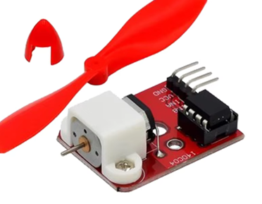

# **KIT DE 71 COMPONENTES ELECTRONICOS PARA MICRO:BIT Y ARDUINO**
*Componente dentro del kit de sensores, actuadores y componentes basicos para aula-laboratorio de informática y robótica*
# **Mini Ventilador L9110**
## **1. Descripción**
El módulo de control del ventilador L9110 incorpora el chip del control del motor L9110. Puede controlar la dirección de la rotación del motor, por lo tanto del ventilador.

Voltaje de funcionamiento: 5 V

Chipset: L9110

Diámetro de la hélice: 75 mm

Tamaño del tablero: 50 x 26 x 15 mm
## **2. Web de interes**

## **3. Foto**

