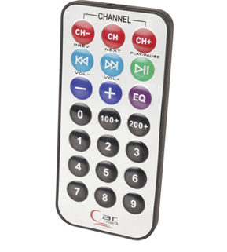

# **KIT DE 71 COMPONENTES ELECTRONICOS PARA MICRO:BIT Y ARDUINO**
*Componente dentro del kit de sensores, actuadores y componentes basicos para aula-laboratorio de informática y robótica*
# **Mando a distancia Infrarojo**
## **1. Descripción**
Transmisión de frecuencia: 38KHz;

Distancia de transmisión: entorno a 8 m (Depende del entorno, la sensibilidad del receptor y otros factores)

Ángulo efectivo: 60 grados

Corriente estática: 3 ~ 5uA, Dynamic actual: 3 ~ 5 mA

Control remoto alimentado por 1 x CR2025 
## **2. Web de interes**
https://electropeak.com/learn/beginners-guide-to-use-ir-remote-transmitter-receiver-arduino/
## **3. Foto**

