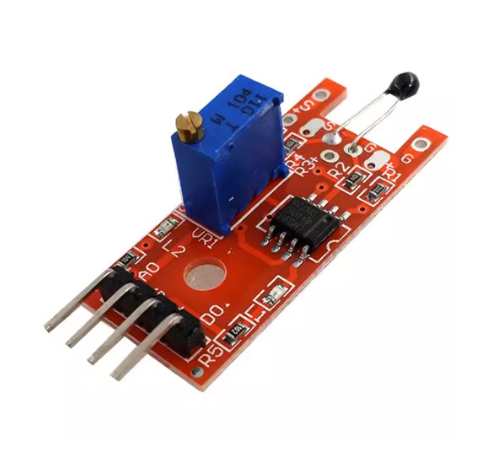

# **KIT DE 71 COMPONENTES ELECTRONICOS PARA MICRO:BIT Y ARDUINO**
*Componente dentro del kit de sensores, actuadores y componentes basicos para aula-laboratorio de informática y robótica*
# **Sensor de temperatura con NTC digital KY-028**
## **1. Descripción**
-Permite medir, de forma rápida, la temperatura a través de un termistor NTC

-3 componentes principales en su placa de circuito: una unidad de sensor en la parte frontal del módulo que mide el área físicamente y envía una seña analógica al amplificador (segunda unidad). Éste envía la señal a la salida analógica del módulo

-Salida analógica: medición directa de la unidad del sensor

-LED 1: muestra que el sensor está recibiendo energía

-LED 2: el sensor ha detectado un campo magnético

-Rango de temperatura: -55ºC / +125ºC

-Voltaje de funcionamiento: 3.3V - 5V

-Dimensiones: 38X15X14mm

-Peso: 4gr
## **2. Web de interes**
https://arduinomodules.info/ky-028-digital-temperature-sensor-module/
## **3. Foto**

