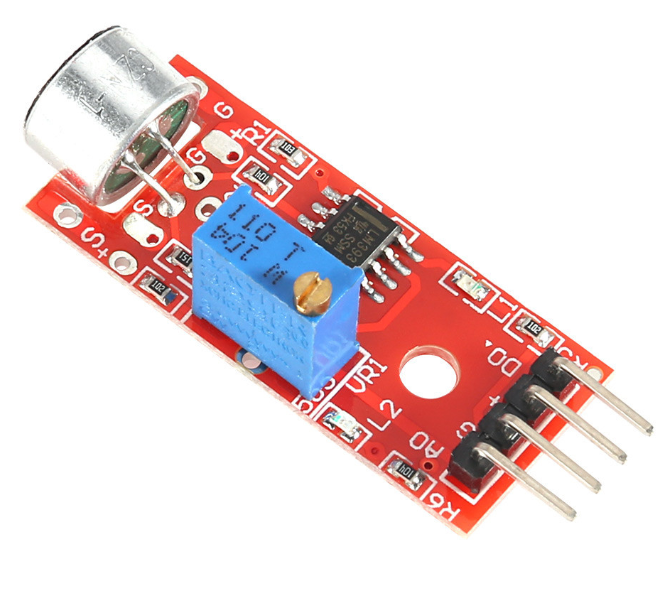

# **KIT DE 71 COMPONENTES ELECTRONICOS PARA MICRO:BIT Y ARDUINO**
*Componente dentro del kit de sensores, actuadores y componentes basicos para aula-laboratorio de informática y robótica*
# **Sensor Analógico de Sonido, Micrófono KY-037**
## **1. Descripción**
-Permite detectar de forma rápida cualquier sonido

-2 salidas: una analógica (AO) y otra digital (DO)

-Permite ajustar un nivel de umbral de salida

-Voltaje de funcionamiento: 5V

-Con luz de encendido

-Luz en la salida del comparador

-Interruptor digital salida (0/1)

-Dimensiones: 35X15X14mm

-Peso: 4gr
## **2. Web de interes**
https://arduinomodules.info/ky-037-high-sensitivity-sound-detection-module/
## **3. Foto**

