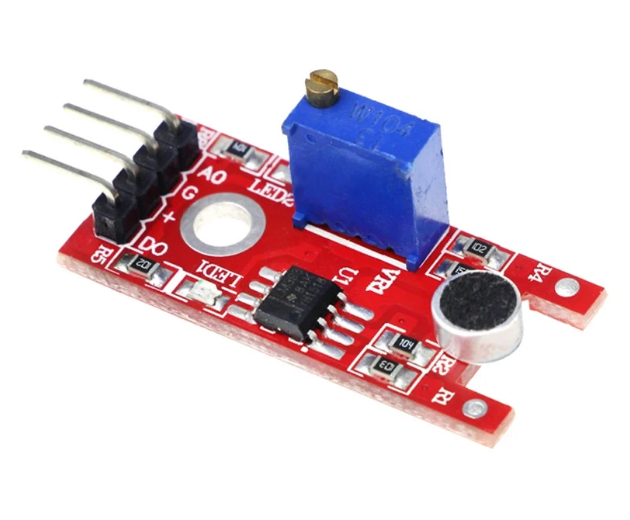

# **KIT DE 71 COMPONENTES ELECTRONICOS PARA MICRO:BIT Y ARDUINO**
*Componente dentro del kit de sensores, actuadores y componentes basicos para aula-laboratorio de informática y robótica*
# **Sensor Analógico de Sonido, Micrófono KY-038.**
## **1. Descripción**
- Voltaje de funcionamiento: 4V -6V DC

-Distancia máxima de inducción: 0.5m

-Chip principal: LM393

-Gama de frecuencia: 100-10.000Hz

-Sensibilidad: -46±2.0 (0dB=1V/Pa) a 1K Hz

-Sensibilidad mínima a ruido: 58dB

-Dimensiones: 36X15X15mm

-Peso: 4gr
## **2. Web de interes**
https://paraarduino.com/kits/kit-de-37-sensores/modulo-sensor-de-sonido/
## **3. Foto**

