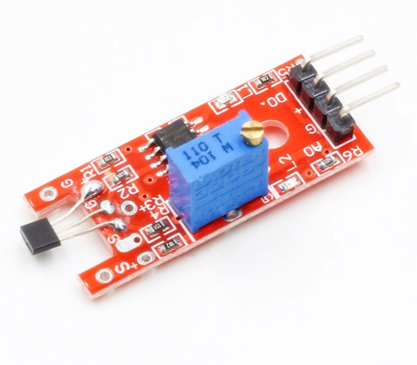

# **KIT DE 71 COMPONENTES ELECTRONICOS PARA MICRO:BIT Y ARDUINO**
*Componente dentro del kit de sensores, actuadores y componentes basicos para aula-laboratorio de informática y robótica*
# **Sensor Hall 49E**
## **1. Descripción**
-Suele usarse para calcular (por lo tanto, ajustar o estabilizar) la velocidad de un mecanismo de rotación como un interruptor de proximidad. Sensor Hall 49E

-Soporta señal digital y analógica con ajuste de umbral de sensibilidad

-Pinout de 4 pines con un paso de 2,54mm fácil de concectar con la MCU

-Voltaje de entrada: 3.3-5V

-Voltaje de salida: 5V

-Voltaje de funcionamiento: 5VDC

-Rango de temperatura: -40ºC a 85ºC

-Entrada/salida actual max, 8/20mA

-Tiempo de respuesta 3µS (muy rápido)
## **2. Web de interes**
https://arduinomodules.info/ky-024-linear-magnetic-hall-module/
## **3. Foto**

