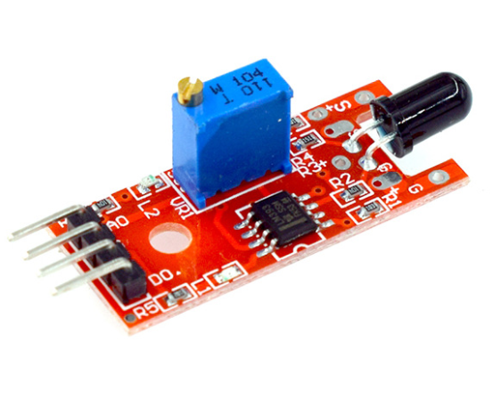

# **KIT DE 71 COMPONENTES ELECTRONICOS PARA MICRO:BIT Y ARDUINO**
*Componente dentro del kit de sensores, actuadores y componentes basicos para aula-laboratorio de informática y robótica*
# **Sensor de llama KY-026**
## **1. Descripción**
Dispone tanto de salidad digital como analógica. Idóneo para aplicaciones de detección de incendios y alarmas de fuego.

-Espectro: 760nm~1100nm

-Ángulo de detección: 0-60 grados

-Alimentación: 3.3V~5.3V

-Temperatura: -25º-85º

-Dimensión: 27.3mm*15.4mm
## **2. Web de interes**
https://arduinomodules.info/ky-026-flame-sensor-module/
## **3. Foto**

