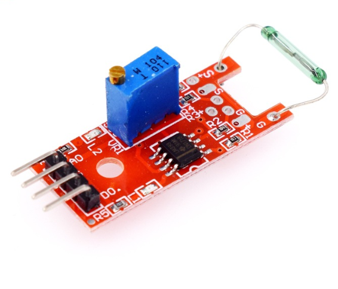

# **KIT DE 71 COMPONENTES ELECTRONICOS PARA MICRO:BIT Y ARDUINO**
*Componente dentro del kit de sensores, actuadores y componentes basicos para aula-laboratorio de informática y robótica*
# **Sensor Reed, interruptor KY025**
## **1. Descripción**
Este tipo de interruptores son dispositivos electromecánicos que se comportan como interruptores que se activan ante la presencia de un imán.

-Voltaje de funcionamiento: 3.3V-5V

-Comparador de salida de corriente: 16mA

-Salidas: analógica y digital

-Sensor magnético de alta sensibilidad

-Vida útil limitada dependiendo del número de conmutaciones

-Dimensiones: 15X35,2X11mm

-Peso: 3gr

La presencia de vibraciones o de cualquier movimiento brusco puede alterar su funcionamiento provocando mediciones erróneas
## **2. Web de interes**
https://arduinomodules.info/ky-025-reed-switch-module/
## **3. Foto**

