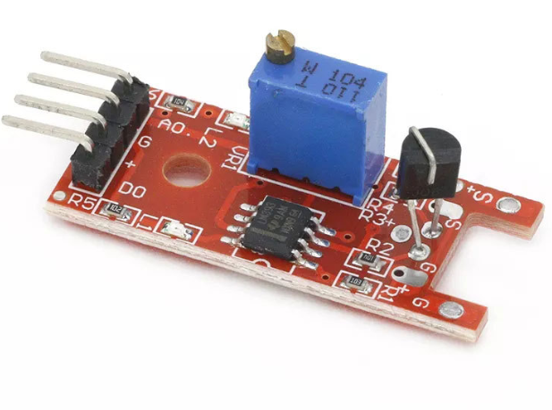

# **KIT DE 71 COMPONENTES ELECTRONICOS PARA MICRO:BIT Y ARDUINO**
*Componente dentro del kit de sensores, actuadores y componentes basicos para aula-laboratorio de informática y robótica*
# **Sensor táctil darlington KY-036**
## **1. Descripción**
Voltaje de funcionamiento: 3.3 a 5V

Emite una señal al led2 si se toca la Base del sensor KSP13

Interruptor digital salida (0 / 1)

Dimensiones: 38 mm x 15 mm x 14mm

Pines:

Salida digital: en el momento de la detección de contacto, se emitirá una señal

Salida analógica: valor de medición directa de la unidad del sensor
## **2. Web de interes**
https://arduinomodules.info/ky-036-metal-touch-sensor-module/
## **3. Foto**

