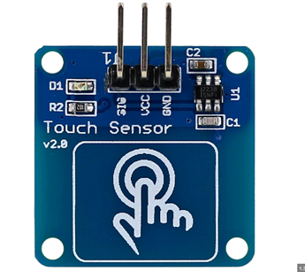

# **KIT DE 71 COMPONENTES ELECTRONICOS PARA MICRO:BIT Y ARDUINO**
*Componente dentro del kit de sensores, actuadores y componentes basicos para aula-laboratorio de informática y robótica*
# **Sensor táctil**
## **1. Descripción**
Bajo consumo de energía;

Chip de control TTP223B

Fuente de alimentación puede ser de 2 ~ 5V CC;

Agujeros para fijación 4 x M2
## **2. Web de interes**

## **3. Foto**

