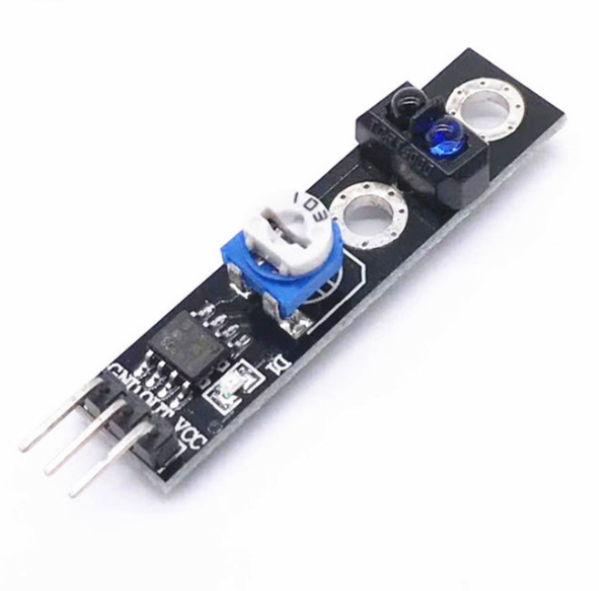

# **KIT DE 71 COMPONENTES ELECTRONICOS PARA MICRO:BIT Y ARDUINO**
*Componente dentro del kit de sensores, actuadores y componentes basicos para aula-laboratorio de informática y robótica*
# **Sensor Seguidor de Líneas**
## **1. Descripción**
-Sensor de detector de obstáculos infrarrojo

-Voltaje de funcionamiento: 3.3V - 5V DC

-Corriente de trabajo: 20mA

-Distancia de detección: 2-40mm

-Señal de salidad: nivel TTL

-Ajuste de sensibilidad: potenciómetro

-Comparador IC: LM393

-Sensor IR: ICRT5000L

-Temperatura de operación: -10ºC a ±50ºC

-Ángulo efectivo: 35º

-Dimensiones: 42X11X11mm
## **2. Web de interes**
https://arduinomodules.info/ky-033-line-tracking-sensor-module/
## **3. Foto**

