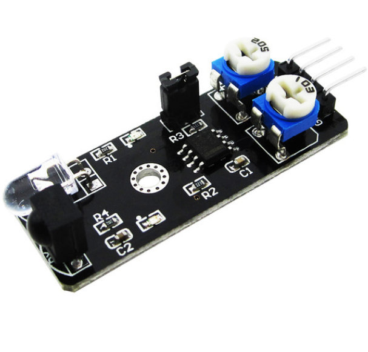

# **KIT DE 71 COMPONENTES ELECTRONICOS PARA MICRO:BIT Y ARDUINO**
*Componente dentro del kit de sensores, actuadores y componentes basicos para aula-laboratorio de informática y robótica*
# **Sensor detector de obstáculos infrarojo**
## **1. Descripción**
Sensor que detecta obstáculos

-Voltaje de funcionamiento: 3.3V-5V DC

-Consumo: =20mA

-Rango de operación: -10ºC-+50ºC

-Distancia de detección: 2 a 40cm

-Señales: (GND/VCC/OUT/EN)

-Interfaces de entrada/salida: (-/+/S/EN)

-Señal OUT: nivel bajo significa que hay un obstáculo

-Ángulo de mediciòn:35º

-Dimensiones: 41X8X13mm

-Peso: 6gr

-Ajuste: Girar con un destornillador el trimpot para la sensibilidad que requiera de detección
## **2. Web de interes**
https://arduinomodules.info/ky-032-infrared-obstacle-avoidance-sensor-module/
## **3. Foto**

