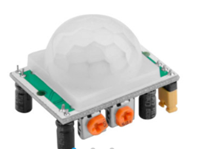

# **KIT DE 71 COMPONENTES ELECTRONICOS PARA MICRO:BIT Y ARDUINO**
*Componente dentro del kit de sensores, actuadores y componentes basicos para aula-laboratorio de informática y robótica*
# **Detector de presencia PIR HC-SR-501**
## **1. Descripción**
Éste módulo PIR HCSR501 es muy sencillo de utilizar y además dispone de dos potenciómetros de ajuste que permiten ajustar tanto la sensibilidad como el tiempo de pulso. Una vez detectado un movimiento, emitirá un pulso por su pin de salida durante el intervalo ajustado.

Sensor PIR

Sensibilidad ajustable

Tiempo de pulso ajustable

Alimentación: 4.5 a 12V

Ángulo de visión: 110 grados

Distancia máxima: 7 metros

Activo a nivel alto

## **2. Web de interes**
https://electropeak.com/learn/pir-motion-sensor-how-pir-work-how-use-with-arduino/
## **3. Foto**

