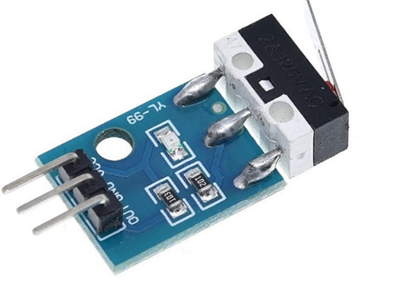

# **KIT DE 71 COMPONENTES ELECTRONICOS PARA MICRO:BIT Y ARDUINO**
*Componente dentro del kit de sensores, actuadores y componentes basicos para aula-laboratorio de informática y robótica*
# **Sensor de choque (final de carrera)**
## **1. Descripción**
Interruptor final de carrera mecánico en formato compacto modelo YL99 (YL-99). Admite tensiones de alimentación de entre 3 y 12V.

Los finales de carrera se usan para detectar cuándo un objeto ha llegado a una posición determinada. Son usados con frecuencia en impresión 3D para detectar cuándo el cabezal de impresión ha llegado al límite en cualquiera de los ejes y detener su avance; aunque se usan también con frecuencia en muchos otros campos de la técnica y la robótica.

El YL-99 proporciona, en la salida, un nivel de tensión alto si no actúa, y un nivel bajo cuando se presiona el final de carrera. El nivel de tensión se proporciona en la salida gracias al pull-up interno de 10kOhm (ver esquema adjunto en las imágenes), por lo que el nivel lógico de la salida es el mismo con el que lo alimentamos.

Incorpora también un LED indicador de detección.
## **2. Web de interes**

## **3. Foto**

