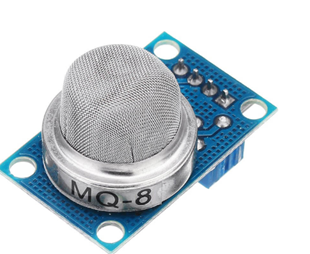

# **KIT DE 71 COMPONENTES ELECTRONICOS PARA MICRO:BIT Y ARDUINO**
*Componente dentro del kit de sensores, actuadores y componentes basicos para aula-laboratorio de informática y robótica*
# **Sensor de gas MQ-8**
## **1. Descripción**
Voltaje de Operación: 5V DC

Respuesta rápida y alta sensibilidad

Rango de detección: 100 a 10000 ppm

Resistencia de carga: 10K

Resistencia de calentamiento: 31 Ohm

Tiempo de Calentamiento: 90s (>24h primera vez)

Consumo de Resistencia: aprox. 800mW

Concentración de Oxigeno: 21%

Salida Digital con sensibilidad regulable
## **2. Web de interes**
https://electropeak.com/learn/interfacing-mq-8-smoke-gas-sensor-module-with-arduino/
## **3. Foto**

