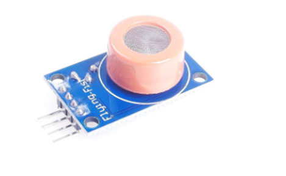

# **KIT DE 71 COMPONENTES ELECTRONICOS PARA MICRO:BIT Y ARDUINO**
*Componente dentro del kit de sensores, actuadores y componentes basicos para aula-laboratorio de informática y robótica*
# **Sensor de Alcohol MQ-3**
## **1. Descripción**
Voltaje de Operación: 5VDC

Integrado amplificador LM393 con umbral mediante potenciómetro.

2 pines de salida (salida analógica y salida de nivel TTL).

Salida de nivel TTL válida de bajo nivel, se puede conectar directamente al microcontrolador.

Salida analógica de 0 ~ 5 V , el voltaje más alto equivale a una concentración más alta.

Condiciones de trabajo: Temperatura ambiente:-10℃ to 65℃, Humedad:≤95% RH
## **2. Web de interes**
https://electropeak.com/learn/interfacing-mq-3-alcohol-gas-sensor-module-with-arduino/
## **3. Foto**

