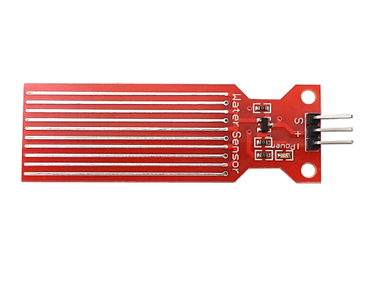

# **KIT DE 71 COMPONENTES ELECTRONICOS PARA MICRO:BIT Y ARDUINO**
*Componente dentro del kit de sensores, actuadores y componentes basicos para aula-laboratorio de informática y robótica*
# **Sensor de lluvia**
## **1. Descripción**
Este sensor analógico (modelo T15921, T-1592) de agua es versátil y fácil de usar. Se puede usar con dos propósitos: Detección de gotas de lluvia y medición del nivel de agua de un recipiente

El sensor consiste en un conjunto de conductores eléctricos en paralelo y el montaje proporciona una salida en tensión proporcional a la resistencia que ofrezca el agua que pueda haber entre ellos. Por este motivo, influye en la medida tanto la cantidad de agua como su conductividad (debido a las sales disueltas). Por lo tanto, debes siempre calibrar este sensor antes de usarlo de manera fiable.

Alimentación: 3,3V / 5V

Área de medición: 40 x 16 mm

Dimensiones totales: 65 x 20 mm

Taladros de montaje: D3mm

Atención: Para funcionar necesita que el líquido sea conductor de la electricidad. Por ejemplo, el agua destilada podría no producir lecturas fiables. Añadir un poco de sal en caso de ser necesario.
## **2. Web de interes**
https://eloctavobit.com/modulos-sensores/sensor-de-agua
## **3. Foto**

